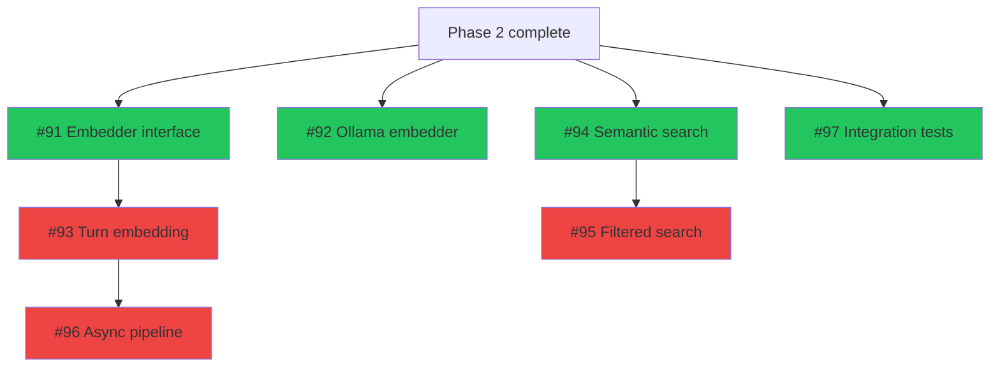
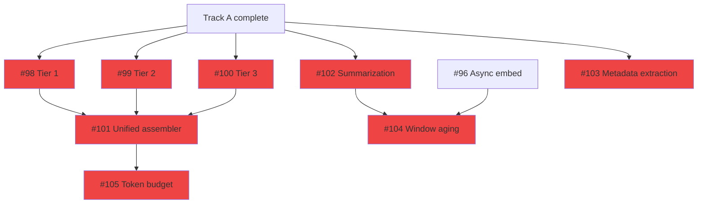
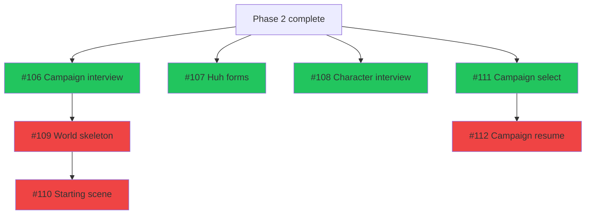
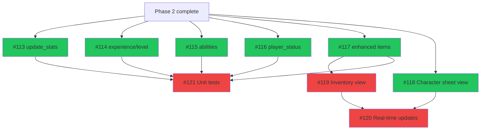
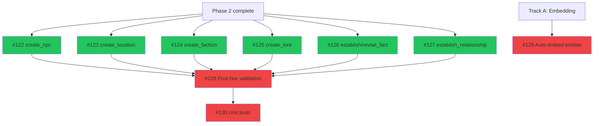
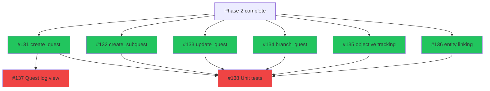
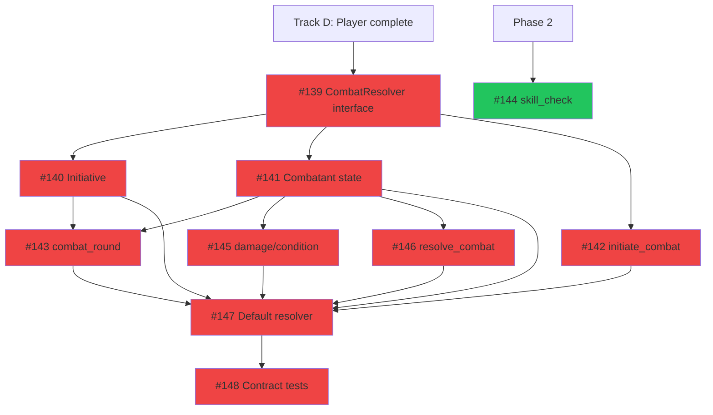
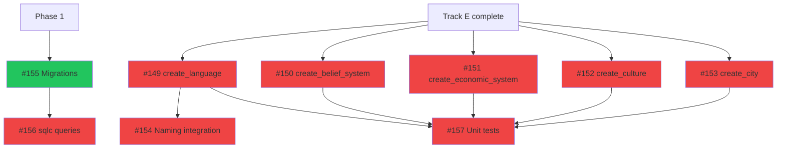
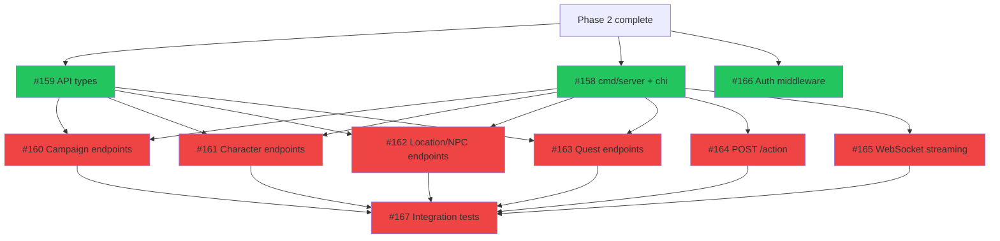
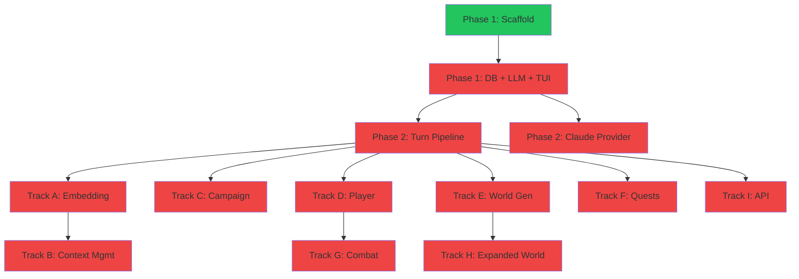

# Phase 3: Game Systems & API

> 77 issues across 9 tracks. **39 ready** (when Phase 2 completes), 38 blocked by internal dependencies.
> Updated: 2026-03-21

## Summary

| Track | Name               | Total  | Ready  | Blocked | Epic | Parallel group | Models              |
| ----- | ------------------ | :----: | :----: | :-----: | ---- | -------------- | ------------------- |
| A     | Embedding & Memory |   7    |   4    |    3    | #7   | Alpha          | Mixed               |
| B     | Context Management |   8    |   0    |    8    | #8   | Beta (after A) | Mixed (Opus-heavy)  |
| C     | Campaign Creation  |   7    |   4    |    3    | #9   | Alpha          | Claude Opus 4.6     |
| D     | Player Character   |   9    |   6    |    3    | #10  | Alpha          | Mixed               |
| E     | World Generation   |   9    |   6    |    3    | #11  | Alpha          | gpt-5.3-codex       |
| F     | Quest System       |   8    |   6    |    2    | #12  | Alpha          | gpt-5.3-codex       |
| G     | Combat             |   10   |   2    |    8    | #13  | Beta (after D) | Claude Opus 4.6     |
| H     | Expanded World     |   9    |   5    |    4    | #14  | Beta (after E) | gpt-5.3-codex       |
| I     | REST API           |   10   |   5    |    5    | #15  | Alpha          | Mixed               |
|       | **Total**          | **77** | **38** | **39**  |      |                |                     |

**Parallel groups:**

- **Alpha** (Tracks A, C, D, E, F, I): All can start immediately when Phase 2 completes. Six independent tracks running simultaneously.
- **Beta** (Tracks B, G, H): Blocked by Alpha tracks. Track B needs Track A. Track G needs Track D. Track H needs Track E.

**Phase entry criteria:** Phase 2 complete (turn pipeline working, player can type and get LLM responses).

**Phase exit criteria:** All game systems implemented. Embedding + semantic memory working. Campaign creation, player management, world generation, quests, combat all functional. REST API serving game state. Expanded worldbuilding tools available.

---

## Track A: Embedding & Memory

> Semantic memory system — pgvector embeddings for long-term recall.
> Depends on: Phase 2 (Epic #6 turn pipeline)
> **Unlocks:** Track B (Context Management)

| #   | Issue                                                          | Title                                         | Size | Blocker | Status  | Model             | Notes                      |
| --- | -------------------------------------------------------------- | --------------------------------------------- | :--: | ------- | ------- | ----------------- | -------------------------- |
| 1   | [#91](https://github.com/PatrickFanella/game-master/issues/91) | Define Embedder interface and types           |  S   | Phase 2 | READY   | Claude Sonnet 4.6 | Do first                   |
| 2   | [#92](https://github.com/PatrickFanella/game-master/issues/92) | Implement Ollama embedding provider           |  S   | Phase 2 | READY   | gpt-5.3-codex     |                            |
| 3   | [#93](https://github.com/PatrickFanella/game-master/issues/93) | Implement turn event embedding and storage    |  M   | #91     | BLOCKED | gpt-5.3-codex     |                            |
| 4   | [#94](https://github.com/PatrickFanella/game-master/issues/94) | Implement semantic search by similarity       |  M   | Phase 2 | READY   | Claude Sonnet 4.6 | Uses sqlc pgvector queries |
| 5   | [#95](https://github.com/PatrickFanella/game-master/issues/95) | Implement metadata-filtered semantic search   |  S   | #94     | BLOCKED | gpt-5.3-codex     |                            |
| 6   | [#96](https://github.com/PatrickFanella/game-master/issues/96) | Implement async embedding pipeline            |  M   | #93     | BLOCKED | Claude Sonnet 4.6 |                            |
| 7   | [#97](https://github.com/PatrickFanella/game-master/issues/97) | Integration tests: pgvector storage/retrieval |  L   | Phase 2 | READY   | Claude Sonnet 4.6 | testcontainers             |



**Parallelizable:** #91, #92, #94, #97 all start simultaneously. #93 after #91. #95 after #94.

---

## Track B: Context Management

> Tiered context window system with turn summarization.
> Depends on: Track A (embedding pipeline)

| #   | Issue                                                            | Title                                   | Size | Blocker   | Status  | Model             | Notes                         |
| --- | ---------------------------------------------------------------- | --------------------------------------- | :--: | --------- | ------- | ----------------- | ----------------------------- |
| 1   | [#98](https://github.com/PatrickFanella/game-master/issues/98)   | Implement Tier 1: always-included state |  M   | Track A   | BLOCKED | gpt-5.3-codex     |                               |
| 2   | [#99](https://github.com/PatrickFanella/game-master/issues/99)   | Implement Tier 2: sliding window        |  M   | Track A   | BLOCKED | gpt-5.3-codex     |                               |
| 3   | [#100](https://github.com/PatrickFanella/game-master/issues/100) | Implement Tier 3: semantic retrieval    |  M   | Track A   | BLOCKED | Claude Sonnet 4.6 | Needs #94, #95                |
| 4   | [#101](https://github.com/PatrickFanella/game-master/issues/101) | Implement unified context assembler     |  M   | #98-#100  | BLOCKED | Claude Opus 4.6   | Combines all tiers            |
| 5   | [#102](https://github.com/PatrickFanella/game-master/issues/102) | Implement turn summarization via LLM    |  M   | Track A   | BLOCKED | Claude Opus 4.6   |                               |
| 6   | [#103](https://github.com/PatrickFanella/game-master/issues/103) | Implement rich metadata extraction      |  S   | Track A   | BLOCKED | gpt-5.3-codex     |                               |
| 7   | [#104](https://github.com/PatrickFanella/game-master/issues/104) | Implement sliding window aging/trigger  |  M   | #96, #102 | BLOCKED | Claude Sonnet 4.6 | Needs async embed + summarize |
| 8   | [#105](https://github.com/PatrickFanella/game-master/issues/105) | Implement token budget awareness        |  S   | #101      | BLOCKED | gpt-5.3-codex     |                               |



**Parallelizable:** #98, #99, #100, #102, #103 all in parallel once Track A completes.

---

## Track C: Campaign Creation

> LLM-guided campaign and character creation.
> Depends on: Phase 2 (Epic #6 turn pipeline)

| #   | Issue                                                            | Title                                       | Size | Blocker | Status  | Model             | Notes                |
| --- | ---------------------------------------------------------------- | ------------------------------------------- | :--: | ------- | ------- | ----------------- | -------------------- |
| 1   | [#107](https://github.com/PatrickFanella/game-master/issues/107) | Implement Huh forms for structured inputs   |  S   | Phase 2 | READY   | gpt-5.3-codex     |                      |
| 2   | [#111](https://github.com/PatrickFanella/game-master/issues/111) | Implement campaign selection screen         |  M   | Phase 2 | READY   | gpt-5.3-codex     |                      |
| 3   | [#106](https://github.com/PatrickFanella/game-master/issues/106) | Implement campaign creation LLM interview   |  L   | Phase 2 | READY   | Claude Opus 4.6   | Core creative flow   |
| 4   | [#108](https://github.com/PatrickFanella/game-master/issues/108) | Implement character creation interview      |  L   | Phase 2 | READY   | Claude Opus 4.6   |                      |
| 5   | [#109](https://github.com/PatrickFanella/game-master/issues/109) | Implement world skeleton generation         |  L   | #106    | BLOCKED | Claude Opus 4.6   | Needs interview data |
| 6   | [#110](https://github.com/PatrickFanella/game-master/issues/110) | Implement starting scene generation         |  M   | #109    | BLOCKED | Claude Opus 4.6   | Needs world skeleton |
| 7   | [#112](https://github.com/PatrickFanella/game-master/issues/112) | Implement campaign resume and state restore |  M   | #111    | BLOCKED | Claude Sonnet 4.6 |                      |



---

## Track D: Player Character

> Character stats, inventory, abilities, and TUI views.
> Depends on: Phase 2 (Epic #6 turn pipeline)
> **Unlocks:** Track G (Combat)

| #   | Issue                                                            | Title                                       | Size | Blocker    | Status  | Model             | Notes                    |
| --- | ---------------------------------------------------------------- | ------------------------------------------- | :--: | ---------- | ------- | ----------------- | ------------------------ |
| 1   | [#113](https://github.com/PatrickFanella/game-master/issues/113) | Implement update_player_stats tool          |  S   | Phase 2    | READY   | gpt-5.3-codex     |                          |
| 2   | [#114](https://github.com/PatrickFanella/game-master/issues/114) | Implement add_experience and level_up tools |  M   | Phase 2    | READY   | gpt-5.3-codex     |                          |
| 3   | [#115](https://github.com/PatrickFanella/game-master/issues/115) | Implement add/remove_ability tools          |  S   | Phase 2    | READY   | gpt-5.3-codex     |                          |
| 4   | [#116](https://github.com/PatrickFanella/game-master/issues/116) | Implement update_player_status tool         |  S   | Phase 2    | READY   | gpt-5.3-codex     |                          |
| 5   | [#117](https://github.com/PatrickFanella/game-master/issues/117) | Implement enhanced item tools               |  M   | Phase 2    | READY   | gpt-5.3-codex     | modify_item, create_item |
| 6   | [#118](https://github.com/PatrickFanella/game-master/issues/118) | Build character sheet TUI view              |  M   | Phase 2    | READY   | Claude Sonnet 4.6 |                          |
| 7   | [#119](https://github.com/PatrickFanella/game-master/issues/119) | Build inventory TUI view                    |  M   | #117       | BLOCKED | Claude Sonnet 4.6 | Needs item properties    |
| 8   | [#120](https://github.com/PatrickFanella/game-master/issues/120) | Implement real-time view updates            |  M   | #118, #119 | BLOCKED | Claude Sonnet 4.6 |                          |
| 9   | [#121](https://github.com/PatrickFanella/game-master/issues/121) | Unit tests: player character tools          |  L   | #113-#117  | BLOCKED | gpt-5.3-codex     |                          |



**Parallelizable:** #113-#118 all start simultaneously. Maximum parallel throughput.

---

## Track E: World Generation

> Core world entity creation tools.
> Depends on: Phase 2 (Epic #6 turn pipeline)
> **Unlocks:** Track H (Expanded World)

| #   | Issue                                                            | Title                                    | Size | Blocker   | Status  | Model             | Notes                       |
| --- | ---------------------------------------------------------------- | ---------------------------------------- | :--: | --------- | ------- | ----------------- | --------------------------- |
| 1   | [#122](https://github.com/PatrickFanella/game-master/issues/122) | Implement create_npc tool                |  M   | Phase 2   | READY   | gpt-5.3-codex     |                             |
| 2   | [#123](https://github.com/PatrickFanella/game-master/issues/123) | Implement create_location tool           |  M   | Phase 2   | READY   | gpt-5.3-codex     |                             |
| 3   | [#124](https://github.com/PatrickFanella/game-master/issues/124) | Implement create_faction tool            |  M   | Phase 2   | READY   | gpt-5.3-codex     |                             |
| 4   | [#125](https://github.com/PatrickFanella/game-master/issues/125) | Implement create_lore tool               |  S   | Phase 2   | READY   | gpt-5.3-codex     |                             |
| 5   | [#126](https://github.com/PatrickFanella/game-master/issues/126) | Implement establish_fact and revise_fact |  M   | Phase 2   | READY   | gpt-5.3-codex     |                             |
| 6   | [#127](https://github.com/PatrickFanella/game-master/issues/127) | Implement establish_relationship tool    |  S   | Phase 2   | READY   | gpt-5.3-codex     |                             |
| 7   | [#128](https://github.com/PatrickFanella/game-master/issues/128) | Implement post-hoc entity validation     |  M   | #122-#127 | BLOCKED | Claude Sonnet 4.6 | Needs all creation tools    |
| 8   | [#129](https://github.com/PatrickFanella/game-master/issues/129) | Implement auto-embedding for entities    |  M   | Track A   | BLOCKED | gpt-5.3-codex     | Needs Embedder from Track A |
| 9   | [#130](https://github.com/PatrickFanella/game-master/issues/130) | Unit tests: world generation tools       |  L   | #122-#128 | BLOCKED | gpt-5.3-codex     |                             |



**Parallelizable:** #122-#127 all start simultaneously.

---

## Track F: Quest System

> Quest creation, branching, tracking, and TUI view.
> Depends on: Phase 2 (Epic #6 turn pipeline)

| #   | Issue                                                            | Title                              | Size | Blocker   | Status  | Model             | Notes                       |
| --- | ---------------------------------------------------------------- | ---------------------------------- | :--: | --------- | ------- | ----------------- | --------------------------- |
| 1   | [#131](https://github.com/PatrickFanella/game-master/issues/131) | Implement create_quest tool        |  M   | Phase 2   | READY   | gpt-5.3-codex     |                             |
| 2   | [#132](https://github.com/PatrickFanella/game-master/issues/132) | Implement create_subquest tool     |  S   | Phase 2   | READY   | gpt-5.3-codex     |                             |
| 3   | [#133](https://github.com/PatrickFanella/game-master/issues/133) | Implement update_quest tool        |  M   | Phase 2   | READY   | gpt-5.3-codex     |                             |
| 4   | [#134](https://github.com/PatrickFanella/game-master/issues/134) | Implement branch_quest tool        |  M   | Phase 2   | READY   | gpt-5.3-codex     |                             |
| 5   | [#135](https://github.com/PatrickFanella/game-master/issues/135) | Implement quest objective tracking |  S   | Phase 2   | READY   | gpt-5.3-codex     |                             |
| 6   | [#136](https://github.com/PatrickFanella/game-master/issues/136) | Implement quest-entity linking     |  S   | Phase 2   | READY   | gpt-5.3-codex     |                             |
| 7   | [#137](https://github.com/PatrickFanella/game-master/issues/137) | Build quest log TUI view           |  M   | #131      | BLOCKED | Claude Sonnet 4.6 | Needs quest data to display |
| 8   | [#138](https://github.com/PatrickFanella/game-master/issues/138) | Unit tests: quest system tools     |  L   | #131-#136 | BLOCKED | gpt-5.3-codex     |                             |



**Parallelizable:** #131-#136 all start simultaneously.

---

## Track G: Combat

> Structured narrative combat system behind pluggable interface.
> Depends on: Track D (Player Character — needs stats/HP)

| #   | Issue                                                            | Title                                        | Size | Blocker    | Status  | Model             | Notes                         |
| --- | ---------------------------------------------------------------- | -------------------------------------------- | :--: | ---------- | ------- | ----------------- | ----------------------------- |
| 1   | [#139](https://github.com/PatrickFanella/game-master/issues/139) | Define CombatResolver interface              |  M   | Track D    | BLOCKED | Claude Opus 4.6   |                               |
| 2   | [#144](https://github.com/PatrickFanella/game-master/issues/144) | Implement skill_check tool                   |  S   | Phase 2    | READY   | gpt-5.3-codex     | Pure logic, no track dep      |
| 3   | [#140](https://github.com/PatrickFanella/game-master/issues/140) | Implement initiative ordering system         |  M   | #139       | BLOCKED | gpt-5.3-codex     |                               |
| 4   | [#141](https://github.com/PatrickFanella/game-master/issues/141) | Implement combatant state management         |  M   | #139       | BLOCKED | Claude Sonnet 4.6 |                               |
| 5   | [#142](https://github.com/PatrickFanella/game-master/issues/142) | Implement initiate_combat tool               |  M   | #139       | BLOCKED | gpt-5.3-codex     |                               |
| 6   | [#143](https://github.com/PatrickFanella/game-master/issues/143) | Implement combat_round tool                  |  L   | #140, #141 | BLOCKED | Claude Opus 4.6   |                               |
| 7   | [#145](https://github.com/PatrickFanella/game-master/issues/145) | Implement apply_damage/apply_condition tools |  M   | #141       | BLOCKED | gpt-5.3-codex     |                               |
| 8   | [#146](https://github.com/PatrickFanella/game-master/issues/146) | Implement resolve_combat tool                |  M   | #141       | BLOCKED | Claude Sonnet 4.6 |                               |
| 9   | [#147](https://github.com/PatrickFanella/game-master/issues/147) | Implement default narrative CombatResolver   |  L   | #140-#146  | BLOCKED | Claude Opus 4.6   | Ties everything together      |
| 10  | [#148](https://github.com/PatrickFanella/game-master/issues/148) | Interface contract tests for CombatResolver  |  L   | #147       | BLOCKED | Claude Opus 4.6   | Reusable for future rule sets |



**Parallelizable after #139:** #140, #141, #142 in parallel. After #141: #143, #145, #146 in parallel.

---

## Track H: Expanded World Generation

> Deep worldbuilding tools: languages, belief systems, economies, cultures, cities.
> Depends on: Track E (World Generation — core entity tools)

| #   | Issue                                                            | Title                                       | Size | Blocker   | Status  | Model             | Notes                   |
| --- | ---------------------------------------------------------------- | ------------------------------------------- | :--: | --------- | ------- | ----------------- | ----------------------- |
| 1   | [#155](https://github.com/PatrickFanella/game-master/issues/155) | Migration: create expanded world tables     |  S   | Phase 1   | READY   | gpt-5.3-codex     | Can start early         |
| 2   | [#156](https://github.com/PatrickFanella/game-master/issues/156) | sqlc queries: expanded world tables         |  S   | #155      | BLOCKED | gpt-5.3-codex     |                         |
| 3   | [#149](https://github.com/PatrickFanella/game-master/issues/149) | Implement create_language tool              |  M   | Track E   | BLOCKED | gpt-5.3-codex     |                         |
| 4   | [#150](https://github.com/PatrickFanella/game-master/issues/150) | Implement create_belief_system tool         |  M   | Track E   | BLOCKED | gpt-5.3-codex     |                         |
| 5   | [#151](https://github.com/PatrickFanella/game-master/issues/151) | Implement create_economic_system tool       |  M   | Track E   | BLOCKED | gpt-5.3-codex     |                         |
| 6   | [#152](https://github.com/PatrickFanella/game-master/issues/152) | Implement create_culture tool               |  M   | Track E   | BLOCKED | gpt-5.3-codex     |                         |
| 7   | [#153](https://github.com/PatrickFanella/game-master/issues/153) | Implement create_city tool                  |  M   | Track E   | BLOCKED | gpt-5.3-codex     |                         |
| 8   | [#154](https://github.com/PatrickFanella/game-master/issues/154) | Implement language naming integration       |  M   | #149      | BLOCKED | Claude Sonnet 4.6 | Uses language phonology |
| 9   | [#157](https://github.com/PatrickFanella/game-master/issues/157) | Unit tests: expanded world generation tools |  L   | #149-#153 | BLOCKED | gpt-5.3-codex     |                         |



**Note:** #155 and #156 (migrations + queries) can start in Phase 1 or Phase 2 since they only need the database. Start them early to avoid blocking the tools.

**Parallelizable after Track E:** #149-#153 all in parallel.

---

## Track I: REST API

> HTTP API wrapping the game engine for future web/mobile clients.
> Depends on: Phase 2 (Epic #6 turn pipeline)

| #   | Issue                                                            | Title                                       | Size | Blocker    | Status  | Model             | Notes                  |
| --- | ---------------------------------------------------------------- | ------------------------------------------- | :--: | ---------- | ------- | ----------------- | ---------------------- |
| 1   | [#159](https://github.com/PatrickFanella/game-master/issues/159) | Define shared API types in pkg/api          |  M   | Phase 2    | READY   | gpt-5.3-codex     |                        |
| 2   | [#158](https://github.com/PatrickFanella/game-master/issues/158) | Create cmd/server entry point + chi router  |  M   | Phase 2    | READY   | gpt-5.3-codex     |                        |
| 3   | [#166](https://github.com/PatrickFanella/game-master/issues/166) | Implement auth middleware interface (no-op) |  S   | Phase 2    | READY   | gpt-5.3-codex     |                        |
| 4   | [#160](https://github.com/PatrickFanella/game-master/issues/160) | Implement campaign REST endpoints           |  M   | #158, #159 | BLOCKED | gpt-5.3-codex     |                        |
| 5   | [#161](https://github.com/PatrickFanella/game-master/issues/161) | Implement character REST endpoints          |  S   | #158, #159 | BLOCKED | gpt-5.3-codex     |                        |
| 6   | [#162](https://github.com/PatrickFanella/game-master/issues/162) | Implement location and NPC REST endpoints   |  M   | #158, #159 | BLOCKED | gpt-5.3-codex     |                        |
| 7   | [#163](https://github.com/PatrickFanella/game-master/issues/163) | Implement quest REST endpoints              |  S   | #158, #159 | BLOCKED | gpt-5.3-codex     |                        |
| 8   | [#164](https://github.com/PatrickFanella/game-master/issues/164) | Implement POST /action endpoint             |  M   | #158       | BLOCKED | Claude Sonnet 4.6 | Core gameplay endpoint |
| 9   | [#165](https://github.com/PatrickFanella/game-master/issues/165) | Implement WebSocket streaming endpoint      |  L   | #158       | BLOCKED | Claude Sonnet 4.6 |                        |
| 10  | [#167](https://github.com/PatrickFanella/game-master/issues/167) | HTTP integration tests for API              |  L   | #160-#165  | BLOCKED | Claude Sonnet 4.6 | testcontainers         |



**Parallelizable:** #158, #159, #166 start simultaneously. Then #160-#165 all in parallel.

---

## Phase 3 Execution Order

```
Sprint 1:  Alpha group — 6 tracks in parallel
           ├── Track A: Embedding (#91, #92, #94, #97 → #93, #95 → #96)
           ├── Track C: Campaign (#107, #111, #106, #108 → #109 → #110, #112)
           ├── Track D: Player (#113-#118 → #119, #120, #121)
           ├── Track E: World (#122-#127 → #128, #129, #130)
           ├── Track F: Quest (#131-#136 → #137, #138)
           └── Track I: API (#158, #159, #166 → #160-#165 → #167)
           Also: Track H #155, #156 (migrations — start early)

Sprint 2:  Beta group — 3 tracks unblocked by Alpha
           ├── Track B: Context Mgmt (#98-#103 → #101 → #104, #105)
           ├── Track G: Combat (#139 → #140-#142 → #143, #145, #146 → #147 → #148)
           └── Track H: Expanded World (#149-#153 → #154, #157)
           Gate: full game loop with memory, combat, deep worldbuilding, API
```

---

## Full Project Dependency Graph


